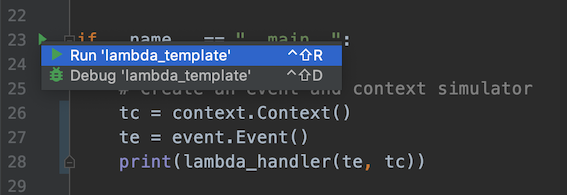
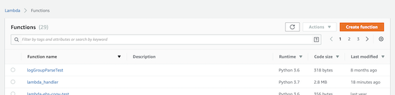
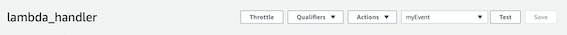
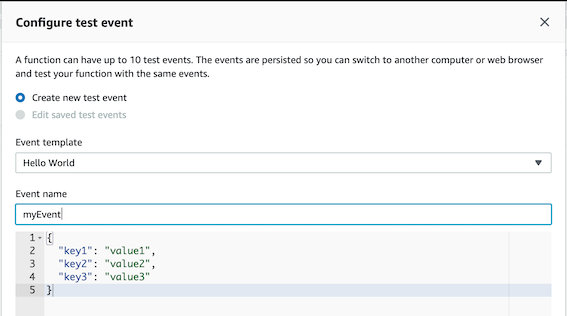
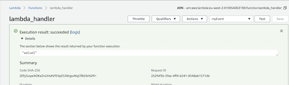

# Lambda Template

---

## Description

Lambda template, as it is, will deploy a lambda to AWS that will print a 
string "value1" when run under the "Hello World" Event Template.

The intended usage is for users to copy this project, deploy to AWS and 
test it, so that they can then add in their own code into the 
lambda_handler function, which they can then easily build and deploy.

The example Lambda – lambda_template/lambda_function.py uses external 
classes in:

* event.py
* context.py

These mock the event and context passed to the Lambda by AWS when 
running on the platform. This means that you can run and debug locally,
both from within Pycharm and also from the command line:

## Workflow

A suggested workflow is to use this lambda template to develop and 
deliver your lambda using the make tasks provided.

* make build
* make test (Unit test your change)
* make lambda_deploy (First upload)
* make lambda_update_function_code (Upload a change without deleting config) 
* make lambda_delete (Clean up on code complete)

If you are thorough enough to create mocks and unit tests for your 
Lambda, you can copy the entire template directory into the prod or 
nonprod directories in order to check them in and preserve them.

This is a good idea for more complex lambdas, while for simpler lambdas,
you only need to deliver the lambda handler and zip archive into the 
appropriate directory.

If your lambda is too simple to warrant that much trouble, then you can 
work in this template directory and just discard the changes when code
complete.

### Note:

_**Always activate your virtual environment before running the tasks!**_

```
lambda_template$ . venv/bin/activate
(venv) lambda_template$ python src/lambda_handler.py 
value1
```
or



---

## Prerequisites

Install homebrew:
	
	https://brew.sh/

Install AWS CLI for command line AWS:

    brew install awscli
    
Install python3:

	https://programwithus.com/learn-to-code/install-python3-mac/

Install a python3 virtual environment:

    make install

---

## Customisation

---

### Makefile

Change the PROJECT parameter to the name of your lambda. This is the 
name it will appear as in the Functions table in the Lambda Dashboard.

Review the annotations for the other parameters and change as needed
 
### lambda_function.py

Change this file name to the name of your project and update the 
Makefile PROJECT entry. e.g.

    lambda_function.py -> ec2_public_ip_check.py
    PROJECT = ec2_public_ip_check

This then becomes the entry point for your lambda handler as seen in 
the "handler" section of the Lambda dashboard:

    ec2_public_ip_check.lambda_handler 

### mocks

The mock files mock the context and event passed to the Lambda by AWS.
You can look up the event payload passed to the Lambda and add the 
JSON in this mock if your Lamdbda needs to reference it while developing
 locally.

You can add in your own libraries in the same directory, and import 
them into the Lambda in the same fashion as the mocks.

### Unit tests

Try to write your supporting functions in separate modules and write 
unit tests for them. 

Examples of unit tests can be found in 
src/test_lambda.py. 

See unit test section of README below for running 
info. 

---

## Usage

---

Build and deployment are controlled via make, see 
```
make tasks
```

### Build

Delete existing lambda:

	make clean

Delete existing lambda and build new version:

	make clean build
	
### Deployment

Deploy to AWS (defaulting to eu-west-2):

	make lambda_deploy
	
Deploy to AWS (overriding region):

	make AWS_REGION=eu-west-1 lambda_deploy
	
Delete from AWS:

	make lambda_delete
	
Delete from overridden region:

	make AWS_REGION=eu-west-1 lambda_delete

### Delivery

Once you have developed and tested your Lambda, you can use make to 
deliver the lambda and zip archive to either the prod or nonprod 
directories for pickup by your production deployment tools.

    make deliver_nonprod
    make deliver prod

### tasks
 
Following defaults can be overwritten in the Makefile, or overridden on 
the command line:

    * AWS_REGION = eu-west-2
    * FUNCTION_NAME = lambda_template
    * LAMBDA_ROLE = arn:aws:iam::410954063198:role/lambda-role
    * MEMORY = 128
    * RUNTIME = 'python3.7'
    * TIMEOUT = 15

---

# Development

## Local Development

The method: 

	if __name__ == "__main__":

is not required by the Lambda, but will let you run it locally on your 
machine and is intended to emulate an event and context, as passed by 
AWS when running in the cloud. 

This should be of some help when 
developing / debugging locally in PyCharm.

## Unit Testing

An example unit test harness is included in the project to encourage you
to use modular libraries of functions and to write unit tests for them.

These can be found in src/test_lambda.py 

They can also be run from within Pycharm or from the command line like 
so:

```
python ./src/test_lambda.py 
...
----------------------------------------------------------------------
Ran 3 tests in 0.000s

OK
```
 
---

# AWS

---

## Lambda Dashboard

After uploading the Lambda to AWS you should see it listed on the functions page:



Hit the Test button on the toolbar:



Pick a suitable event template and give your test event a name:



Hit Test button again to run the Lambda test and see the results at the top of the page:



---
